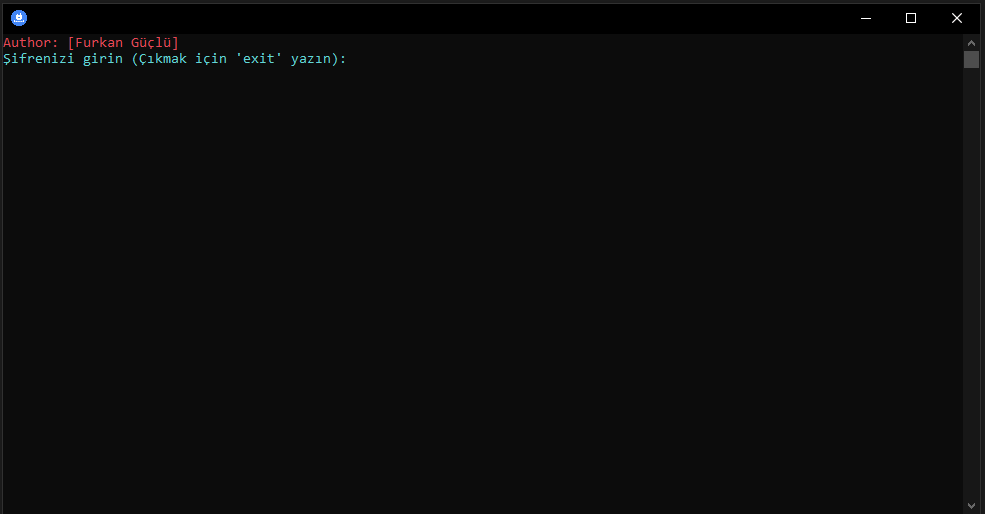

# HashGenerator

  

 EN
 The Hash Generator program takes a user-provided password, computes its SHA-1 hash, and then performs further processing on that hash. Specifically, it converts the SHA-1 hash into binary format, recalculates the SHA-1 hash of the binary data, and finally outputs the result. The program is designed to provide a straightforward way to generate and display SHA-1 hashes, with color-coded console output for ease of use.
 
 TR
Hash Üretici programı, kullanıcı tarafından sağlanan bir şifrenin SHA-1 hash'ini hesaplar ve ardından bu hash üzerinde bazı işlemler gerçekleştirir. Özellikle, SHA-1 hash'ini binary formata dönüştürür, binary verinin SHA-1 hash'ini tekrar hesaplar ve son olarak sonucu ekrana yazdırır. Program, SHA-1 hash'lerini oluşturmak ve göstermek için basit bir yöntem sunar, renkli konsol çıktısı sayesinde kullanımını kolaylaştırır.